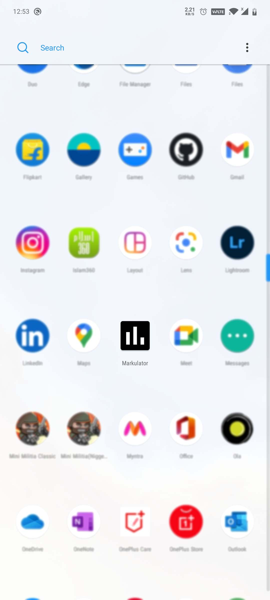
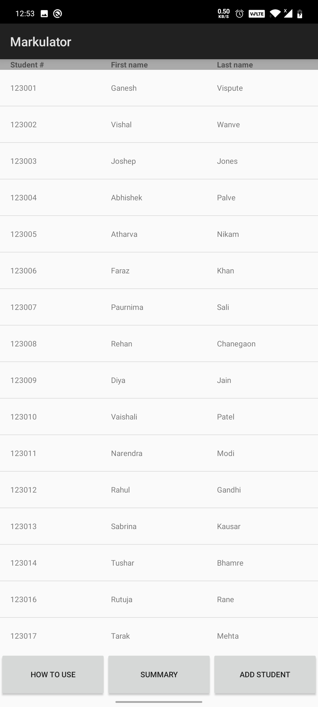
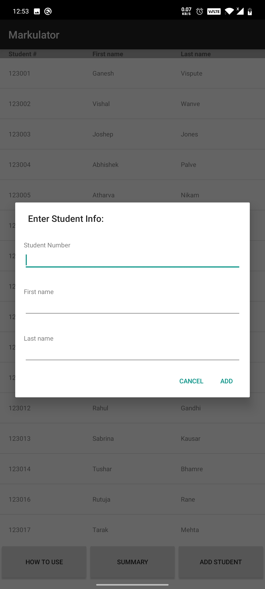
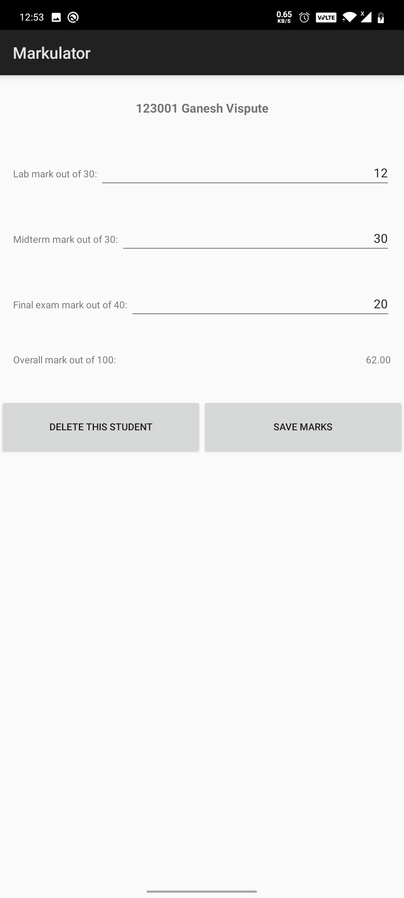
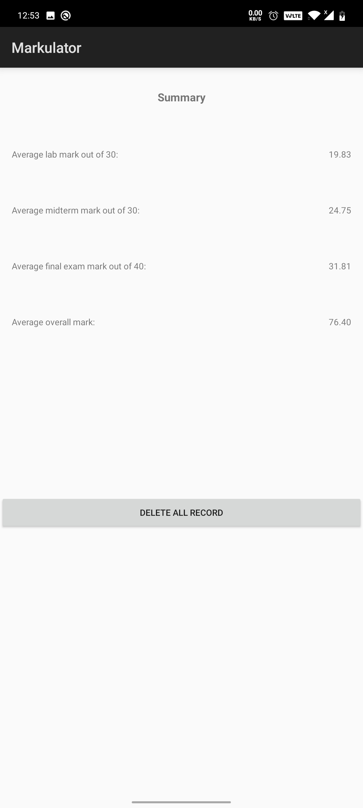
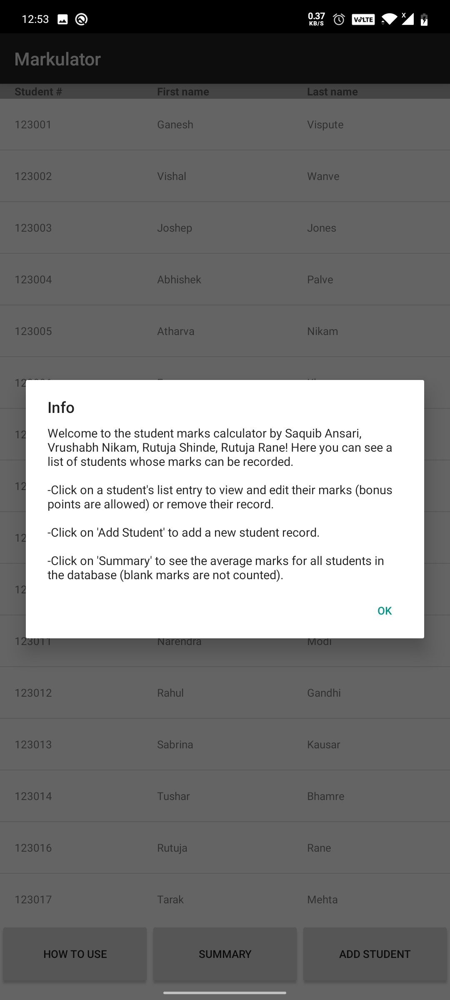

# Markulator AKA Student-Marks-App

## What I wanted to do

I wanted to make an app to help manage student marks.

## What I did

## What I have learned

 - How to use Fragments in Android App development
 - About the Fragment control
 - How to use SQLite DB in Android App development
 - How to use database query to do desired operation in app
 - How to do CRUD operations on DB using GUI of Android Application
 - How to optimize application and handle exceptions

## Screens
  
  
  
  
  
  
